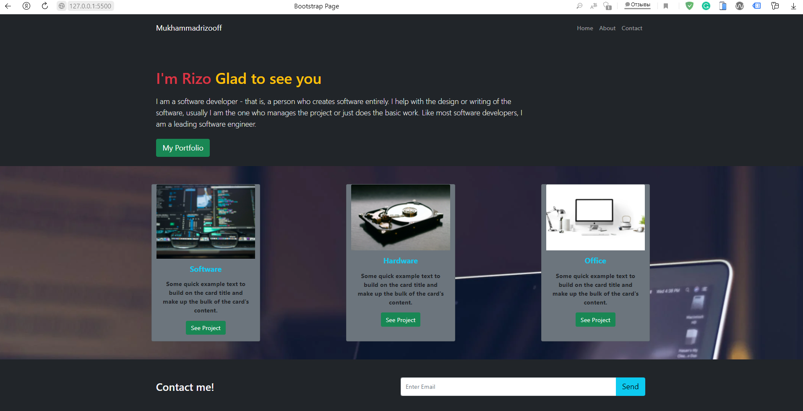

# Try-Bootstrap

> One paragraph statement about the project.

## Built With

- HTML
- CSS 
- Bootstrap Framework
- Git & GitHub

## Live Showroom

[Live Demo Link]()

## Author

👤 Author1

- GitHub: [@mukhammadrizooff](https://github.com/mukhammadrizooff)
- LinkedIn: [LinkedIn](linkedin.com/in/mukhammadrizooff)

## Cloning a repository
- On GitHub.com, navigate to the main page of the repository. Above the list of files, click Download icon and Code.
- Copy for git clone
- Type git clone, and then paste the URL you copied earlier.
`$ git clone https://github.com/mukhammadrizooff/Try-Bootstrap.git`
- Finally press Enter 

## Show your support

Give a ⭐️ if you like this project!